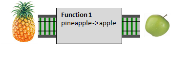
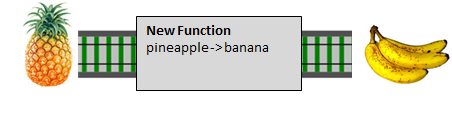
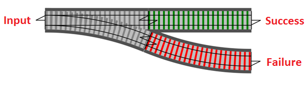
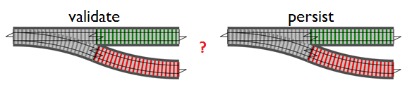
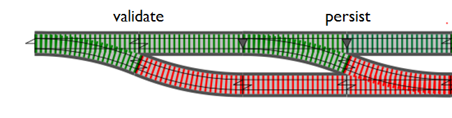
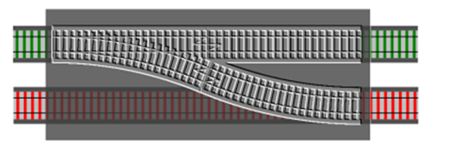

- title : ROP
- description : Railway Oriented Programming @ FSharping
- author : Honza Brestan
- theme : simple
- transition : default

***

### Railway Oriented Programming

Functional approach to error handling

***

### Happy path

Surely this is all that can happen...

---

### Imperative example

    [lang=cs]
    public IHttpActionResult CreateReservation(ReservationDTO reservation)
    {
        Validate(reservation);
        PersistAndUpdate(reservation);
        SendNotification(reservation);
        return Json(reservation);
    }

---

### Functional example

    let createReservation reservation =
        validate reservation
        |> persistAndUpdate
        |> sendNotification
        |> Json

---

### Let's aim for point-free

    let createReservation =
        validate
        >> persistAndUpdate
        >> sendNotification
        >> Json

***

### But we can't have nice things

- Validations fail
- DB connections drop
- SMTP servers get overloaded
- other things can go wrong

---

### Imperative

    [lang=cs]
    public IHttpActionResult CreateReservation(ReservationDTO reservation) {
        Validate(reservation);
        PersistAndUpdate(reservation);
        SendNotification(reservation);
        return Json(reservation);
    }

---

### Imperative

    [lang=cs]
    public IHttpActionResult CreateReservation(ReservationDTO reservation) {
        var validated = Validate(reservation);
        if (!validated) {
            return BadRequest("Reservation invalid!");
        }
        PersistAndUpdate(reservation);
        SendNotification(reservation);
        return Json(reservation);
    }

---

### Imperative

    [lang=cs]
    public IHttpActionResult CreateReservation(ReservationDTO reservation)
    {
        var validated = Validate(reservation);
        if (!validated) {
            return BadRequest("Reservation invalid!");
        }
        var updatedReservation = PersistAndUpdate(reservation);
        if (updatedReservation == null) {
            return BadRequest("Unable to persist reservation!");
        }
        SendNotification(updatedReservation);
        return Json(reservation);
    }

---

### Imperative

    [lang=cs]
    public IHttpActionResult CreateReservation(ReservationDTO reservation)
    {
        var validated = Validate(reservation);
        if (!validated) {
            return BadRequest("Reservation invalid!");
        }
        try {
            var updatedReservation = PersistAndUpdate(reservation);
            if (updatedReservation == null) {
                return BadRequest("Unable to update reservation!");
            }
        } catch {
            return InternalServerError("DB error: unable to persist reservation!");
        }
        SendNotification(updatedReservation);
        return Json(updatedReservation);
    }

---

### Imperative

    [lang=cs]
    public IHttpActionResult CreateReservation(ReservationDTO reservation)
    {
        var validated = Validate(reservation);
        if (!validated) {
            return BadRequest("Reservation invalid!");
        }
        try {
            var updatedReservation = PersistAndUpdate(reservation);
            if (updatedReservation == null) {
                return BadRequest("Unable to update reservation!");
            }
        } catch {
            return InternalServerError("DB error: unable to persist reservation!");
        }
        try {
            SendNotification(updatedReservation);
        } catch {
            log.Error("Confirmation not sent!");
        }
        return Json(updatedReservation);
    }

---

### Functional?

    let createReservation =
        validate
        >> persistAndUpdate
        >> sendNotification
        >> respond

***

### What does any of this have to do with railways?

---

    let f: 'a -> 'b = ...

---

    let f: 'a -> 'b = ...
    let g: 'b -> 'c = ...

---

    let f: 'a -> 'b = ...
    let g: 'b -> 'c = ...
    let h = f >> g

---

    let h: 'a -> 'c = f >> g

---

### Switches

---

    let validate: Reservation -> Reservation option = ...
    let persist:  Reservation -> Reservation option = ...

---

    let validate: Reservation        -> Reservation option = ...
    let persist': Reservation option -> Reservation option = ...

---

    let persist' = Option.bind persist

***

#
